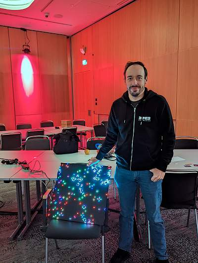

# RGB-LED-Matrix-Projekt

## Projektbeschreibung
Die 128x128 RGB-LED-Matrix ist aus acht einzelnen 64x32 RGB-LED-Panels zusammengesetzt. Die Matrix wurde bei verschiedenen Chaos-Events, wie dem Chaos Communication Congress, der Gulasch Programmier Nacht und den MRMCD in Darmstadt, vorgestellt. Ziel des Projekts ist es, Bilder (GIFs und PNGs) anzuzeigen und Conways Game of Life abzuspielen.  

## PyGame Version
Eine sehr stark an diese Implementation angelehnte PyGame Variante die auch ganz einfach ohne RGB-LED-Matrix ausgeführt werden kann ist [hier](https://github.com/SimonWaldherr/RGB-CGOL) verfügbar.  
Implementationen in anderen Programmiersprachen findet ihr [hier](https://github.com/SimonWaldherr/GameOfLife).

## Hardware
- **Raspberry Pi 4**: [Amazon-Link](https://amzn.to/48lFHnz)
- **Adafruit RGB Matrix HAT + RTC für Raspberry Pi**: [Amazon-Link](https://amzn.to/48eXeOl)
- **8x RGB-LED-Matrix 64x32 P4 (Hub75)**: [Amazon-Link](https://amzn.to/3tzDdDf)
- **5V Netzteil (min. 4A)**: [Amazon-Link](https://amzn.to/3TNKPfS)

## Software
Dieses Projekt verwendet Golang in Kombination mit der `go-rpi-rgb-led-matrix`-Bibliothek. Weitere Informationen zur Installation und Konfiguration der Bibliothek finden Sie hier: [go-rpi-rgb-led-matrix](https://github.com/mcuadros/go-rpi-rgb-led-matrix).

## Aufbau / Anleitung
*ich werde demnächst eine Aufbau- und Installationsanleitung hier einfügen.*

## Mitwirkung
Das Projekt ist ein offenes Vorhaben unter der MIT-Lizenz. Vorschläge, Verbesserungen und Erweiterungen durch die Community sind willkommen. Jede Form der Mitwirkung, sei es durch Code-Beiträge oder Feedback, wird geschätzt.

## Zukunftsideen und Aufruf zur Zusammenarbeit
Für zukünftige Veranstaltungen, wie den 38C3, habe ich die Idee, ein noch größeres LED-Panel-Projekt zu realisieren. Interessierte, die bei diesem Vorhaben mitwirken möchten, sind herzlich eingeladen, sich zu beteiligen. Ich überlege auch, einen Workshop zu diesem Thema anzubieten, um Erfahrungen und Wissen zu teilen.

## Lizenz
Dieses Projekt steht unter der MIT-Lizenz.
